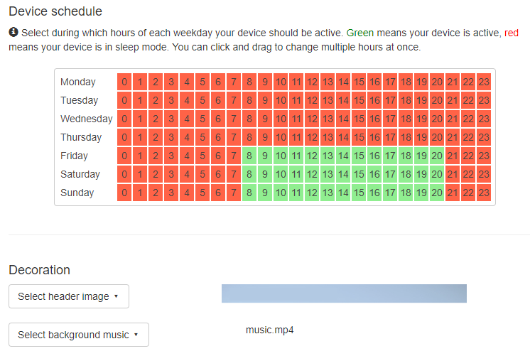
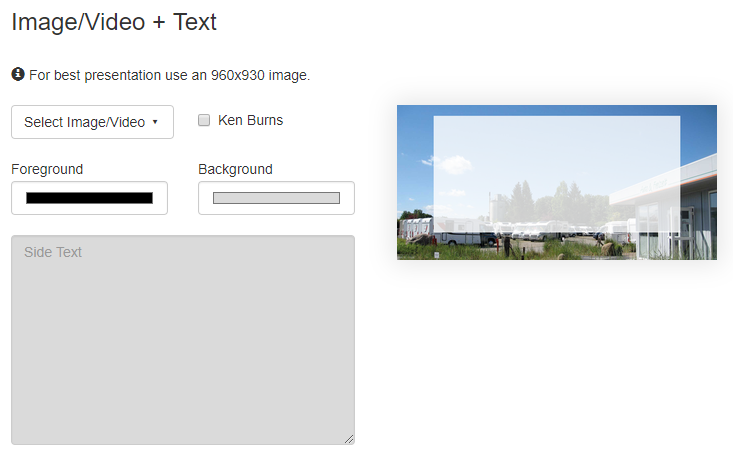
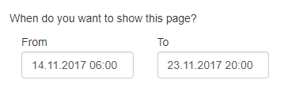

# Appointment Screen

This package allows you to display current shipments, images, videos and text next to a text scroller.
All offered with an easy configuration interface that allows you to schedule your
content. If there is nothing to show the display will turn off automatically.

[](https://info-beamer.com/use?url=https://github.com/niclasku/appointment-node)

## Configuration Screen

Once you install this package, create a new setup by clicking the **Create Setup** button.
You'll end up in the setup configuration page that allows you to configure your
appointment screen. First can set some general options that apply to all pages displayed.
It will look like this:



You also have the option to set a header image. The header image
should have the resolution 1920x100, so it fits perfectly. The header image
is shown for all pages except when you choose to show an images/video in
fullscreen mode.

You are also able to change the background music. Background music has to be a small
video in the .mp4 format.

## Adding Pages

Now it is time to add your content. You can add as many pages as you want.
Just click on **Add** to create a new page.



In the top panel you can select multiple layouts:

 * *Text on left side* - Will show an image and a text. The text will be on the left half of the screen.
 * *Text on right side* - Same as above except that the text is on the right side.
 * *Fullscreen* - Shows a video/image in fullscreen mode. This will hide the header image.
 * *Delivery text* - Shows the welcome text for customers with name and model.
 * *Centered text* - Shows user defined text on the selected background.

Next to the layout dropdown you can see the *Duration* selector. You can select how long the
current page should be visible before switching to the next one.

Finally you can select a custom schedule for your content. By default your content is
scheduled for tomorrow. If you click on the *Schedule* button, you can select the timespan for when the content is
scheduled:



Note that the turn on and turn off values from global configuration have a higher priority.

## Fullscreen Pages

If you choose the fullscreen page layout you can select one of your images/videos.
It will take up the full screen except for the static bottom bar with its
scrolling text which is an overlay. The clock is not shown on these pages.

## Text Right/Left Pages

If you select one of the text page options you can now select an image or video.
It should have a resolution of 960x930 to fit perfectly into one half of the
screen. For images you'll also have the option of selecting if
the image should slowly pan (the ken-burns effect).

You can also select the background color and text color for the other half of the
screen. Just click on the color selectors and choose your color.

Finally there is the text field that allows you to input the text you
want to show on the screen. It supports a limited set of markdown to
allow you to easily format your text:

Use *#* or *##* to create a headline like this:

```
#Headline

##Sub header

Normal text
```

Use *!#*, *!##* or *!###* for different sized centered headlines. For vertically centered lines you can use *!*

You can also render tabular data using the *|* character like this:

```
Opening times:

Mo-Fr | 9am - 6pm
Sa | 1pm - 6pm
So | Closed
```

All text is automatically wrapped on the screen.

## Centered Text

Use this option if you want to show text with a special background or with the default background.
The text fits perfectly if you keep in mind that the text field will be shown at 220 x 215
with a size of 1480 x 700. Text will be formatted like above.

You can also select the text color using the color picker.

## Delivery Text

Use this option if you want to show the welcome text for customers. You can select a different background and you can change the text color. The page can be shown properly if you fill out at least the name or the model field.

## Scrolling Text

If you want to add scrolling text, select the *Scroller* node on
the left side of the configuration screen. You'll see the
configuration interface for the scroller. You can add your
own text here by clicking on the *Add Text* button and then
adding your text in the new row.

## Changelog

### Version 0.1

 * Added device schedule
 * Added support for better scheduling setting per page
 * Added background music
 * Fixed text wrapping
 * Added delivery text option
 * Added centered text option
 * Added text formatting options
